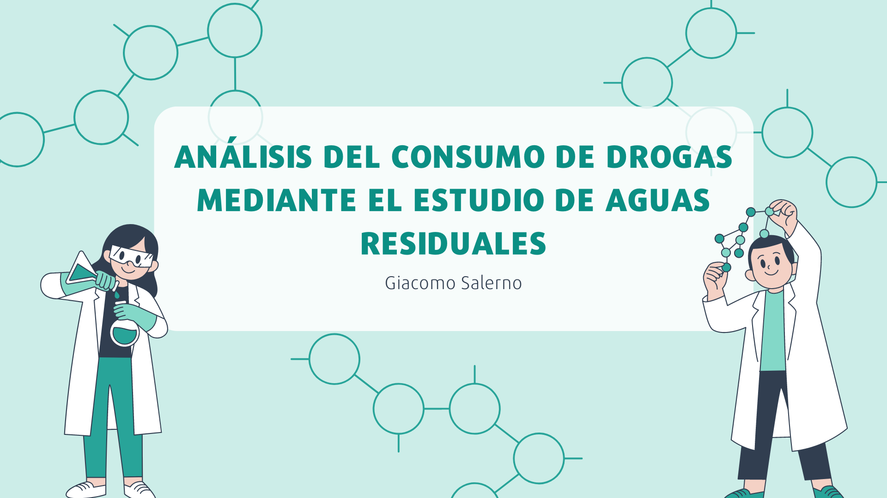

# Análisis del Consumo de Drogas Mediante el Estudio de Aguas Residuales
## Análisis Exploratorio de Datos

Mediante el estudio de disponibilidad de cinco diferentes metabolitos en las aguas residuales, se puede deducir que dicha disponibilidad es directamente proporcional al consumo, lo que permite resolver algunas interrogantes como cuáles son los países que más drogas consumen a nivel europeo, si hay alguna relación con el crecimiento de la población o si la pandemia ha impactado en el uso de drogas a través del continente.  

Respecto a España, se realizan los mismos análisis a pesar de que los datos son más reducidos y se evalúa el consumo en algunas de sus ciudades.

## Hipótesis Planteadas
1) El consumo de drogas en España está directamente relacionado a su población.
2) El consumo de drogas ha aumentado desde la pandemia
3) El consumo de cocaína es mayor que el consumo de otras drogas

## Fuentes de Datos
* [Observatorio Europeo de las Drogas y las Toxicomanías (OEDT)](https://www.emcdda.europa.eu/index_en)
* [World Bank](https://data.worldbank.org/)
